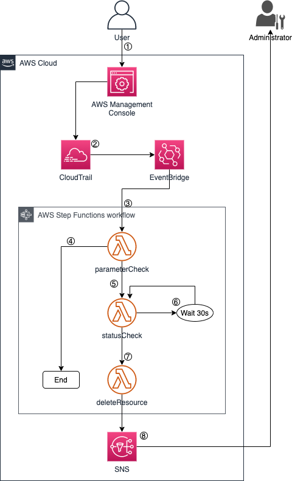

# Limit-Service-Size-for-ElastiCache-Redshift

中文 ｜ [English](README-ENG.md)

## 背景介绍
根据 AWS 文档中介绍的最佳实践，在创建 IAM 用户时需要遵循 [“最小权限”](https://docs.aws.amazon.com/zh_cn/IAM/latest/UserGuide/best-practices.html#grant-least-privilege)原则。绝大多数的权限控制都可以通过 IAM 策略来完成。在某些情况下，管理员不但要限制某个用户可以使用哪些服务，还要限制用户可以使用什么规格的服务。例如，仅允许用户启动 c5.2xlarge 的 EC2 实例。

然而，并非所有的服务都支持通过 IAM 策略中的 [“条件”](https://docs.aws.amazon.com/zh_cn/IAM/latest/UserGuide/reference_policies_elements_condition.html) 来限制所允许使用的实例大小。本文中将介绍如何利用 EventBridge，Step Functions 和 Lambda 来间接实现对服务类型的控制。

## 实现原理
AWS 上所有的 API 操作都可以被 CloudTrail 记录。本方案就是利用 CloudTrail 捕获所有创建资源的 API 操作，对 API 调用中过程中传递的实例规格参数进行监控。当发现参数中请求的参数高于权限限制时，自动触发 Lambda 函数将新创建出来的资源删除掉。以此实现对资源类型的精细化控制。

整个方案的架构如下图：

1. 用户登陆 AWS 控制台（或使用 SDK/CLI）创建相关资源；
2. CloudTrail 将捕获的 API 调用传递给 EventBridge 中的事件总线；
3. EventBridge 根据事件总线上定义的规则处罚 Step Functions 的工作流；
4. Lambda 函数 <code>parameterCheck</code> 对 API 中请求的参数进行校验，如果符合规定则不做任何处理，推出 Strep Functions 的工作流；
5. 如果参数校验的结果是用户提出了超出自己权限范围的服务规格申请，则触发 <code>statusCheck</code> 函数；
6. <code>statusCheck</code> 函数对新创建出来的资源做状态检查，如发现资源不出与可用状态时，等待 30 秒后重新检查服务状态；
7. 当服务进入到可用状态后，触发 <code>deleteResource</code> 函数，删除新创建的服务（当服务未进入到可用状态时，不能被删除）；
8. 服务删除后，通过 SNS 服务向管理员发送消息，告知有违规资源已经被删除。

不同服务的调用参数不同，因此需要针对不同的服务使用不同的代码。本文中将给出针对 [ElastiCache (Redis)](Redis-CN.md) 和 [Redshift](Redshift-CN.md) 的控制代码作为示例。
