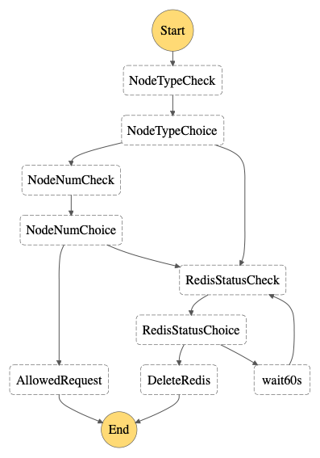
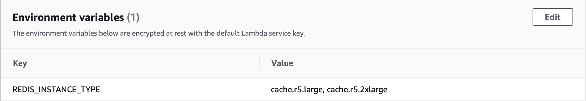

## Control-Redis-Size

中文 ｜ [English](Redis-ENG.md)

### 介绍
ElastiCache 兼容两种服务，Redis 和 Memcached。本示例中针对 Redis 进行控制，仅允许用户创建指定实例规格、制定节点数量的 redis 服务。所需创建的服务资源及说明如下表：

序号 | 资源类型 | 资源名称 | 说明 
----|------|------|------
1 | SNS Topic | NotifyMe | 如资源违规，删除资源后向管理员发送通知邮件
2 | EventBridge Rule | redisControl | 过滤出 ElastiCache 服务下所有创建集群的 API 调用
3 | Step Functions State machines | RedisLimit | 检查 redis 创建是否合规的状态机
4 | Lambda Function | nodeTypeCheck | 检查是否选择了 redis、实例规格是否符合要求
5 | Lambda Function | nodeNumberCheck | 检查是否符合节点数量的要求
6 | Lambda Function | statusCheck | 检查 redis 的状态
7 | Lambda Function | deleteCluster | 删除 redis

当 CloudTrail 捕获到创建资源的 API 调用后，会触发 Step Functions 中定义好的状态机，该状态机进行如下判断：



状态机会依次对请求参数中资源的实例类型、数量进行判断，如发现任意一项超出了限制，将会启动资源删除的环节。在 AWS 上，任意资源如果没有进入 Available 状态，则不能删除。因此为了正常删除资源，状态机必须先进入状态检查的环节（RedisStatusCheck），如发现资源不是 Available 状态，则等待 60 秒后重新检查状态。待资源进入 Available 状态后，删除资源。

### 部署
**1. （可选步骤）创建 CloudTrail**  

>如当前账户中已经创建了 CloudTrail trail，则可以跳过此步骤

- 创建 S3 存储桶：

```
BUCKET_NAME=bucket4trail	#可根据需要自定义 S3 存储桶的名称

aws s3api create-bucket --bucket $BUCKET_NAME --region cn-north-1 --create-bucket-configuration LocationConstraint=cn-north-1
```

注意，如果创建的桶不在 us-east-1，则必须增加 --region 和 --create-bucket-configuration 两个参数。上述命令是在 BJS 区域创建一个 S3 存储桶。

- 修改存储桶策略：

```
TRAIL_NAME=rscLimit	#可根据需要自定义 trail 的名称

ACCOUNT_ID=`aws sts get-caller-identity | jq -r ".Account"`

cat << EOF > s3policy.json
{
    "Version": "2012-10-17",
    "Statement": [
        {
            "Sid": "AWSCloudTrailAclCheck20150319",
            "Effect": "Allow",
            "Principal": {
                "Service": "cloudtrail.amazonaws.com"
            },
            "Action": "s3:GetBucketAcl",
            "Resource": "arn:aws-cn:s3:::$BUCKET_NAME"
        },
        {
            "Sid": "AWSCloudTrailWrite20150319",
            "Effect": "Allow",
            "Principal": {
                "Service": "cloudtrail.amazonaws.com"
            },
            "Action": "s3:PutObject",
            "Resource": "arn:aws-cn:s3:::$BUCKET_NAME/AWSLogs/$ACCOUNT_ID/*",
            "Condition": {
                "StringEquals": {
                    "s3:x-amz-acl": "bucket-owner-full-control"
                }
            }
        }
    ]
}
EOF

aws s3api put-bucket-policy --bucket $BUCKET_NAME --policy file://s3policy.json 
```

- 创建 CloudTrail trail：

```
aws cloudtrail create-trail --name $TRAIL_NAME --s3-bucket-name $BUCKET_NAME
```

**2. 创建 SNS Topic**

```
TOPIC_NAME=notifyMe	#可根据需要自定义 topic 的名称

NOTIFY_TOPIC_ARN=`aws sns create-topic --name $TOPIC_NAME --region cn-north-1 | jq -r ".TopicArn"`
```

通过 AWS 控制台选择 ```Amazon SNS > 订阅 > 创建订阅```，输入网络管理员邮件地址，如下图：  


需要通过管理员的邮箱确认上述订阅。

**3. 创建 IAM 角色**

```
cat << EOF > roleLambda.json
{
  "Version": "2012-10-17",
  "Statement": [
    {
      "Effect": "Allow",
      "Principal": {
        "Service": "lambda.amazonaws.com"
      },
      "Action": "sts:AssumeRole"
    }
  ]
}
EOF


ROLE_NAME=redisLimitRole	#可根据需要自定义 role 的名称

aws iam create-role --role-name $ROLE_NAME --assume-role-policy-document file://roleLambda.json --region cn-north-1

aws iam attach-role-policy --role-name $ROLE_NAME --policy-arn arn:aws-cn:iam::aws:policy/CloudWatchLogsFullAccess

aws iam attach-role-policy --role-name $ROLE_NAME --policy-arn arn:aws-cn:iam::aws:policy/AmazonElastiCacheFullAccess

aws iam attach-role-policy --role-name $ROLE_NAME --policy-arn arn:aws-cn:iam::aws:policy/AmazonSNSFullAccess
```

**4. 创建 nodeTypeCheck 函数**

```
aws lambda create-function --function-name redisLimit-01-nodeTypeCheck \
--role "arn:aws-cn:iam::"$ACCOUNT_ID":role/"$ROLE_NAME"" \
--runtime python3.6 \
--handler lambda_function.lambda_handler \
--timeout 3 \
--zip-file fileb://deployment/redisLimit-01-nodeTypeCheck.zip \
--environment "Variables={ \
INTER_BUCKET=cache.r5.large}" \
--region cn-north-1
```

该函数将检查服务启动请求中所要求的实例类型是否符合要求，并给出检查结果，可从 [这里](code/redisLimit-01-nodeTypeCheck.py) 查看函数代码。函数配置了环境变量 <code>REDIS\_INSTANCE\_TYPE</code>，用于指明用户允许启动的实例类型。如果需要允许用户启动多个类型的实例，可以在环境变量变量中设置多个类型，并用英文 “,” 隔开，如下图示意：



**5. 创建 nodeNumberCheck 函数**

```
aws lambda create-function --function-name redisLimit-02-nodeNumberCheck \
--role "arn:aws-cn:iam::"$ACCOUNT_ID":role/"$ROLE_NAME"" \
--runtime python3.6 \
--handler lambda_function.lambda_handler \
--timeout 3 \
--zip-file fileb://deployment/redisLimit-02-nodeNumberCheck.zip \
--environment "Variables={ \
NUM_OF_NODES=3}" \
--region cn-north-1
```

该函数将检查服务启动请求中所要求的实例数量是否符合要求，并给出检查结果，可从 [这里](code/redisLimit-02-nodeNumberCheck.py) 检查函数代码。函数配置了环境变量 <code>NUM\_OF\_NODES</code>，用户仅允许启动不大于该数值的节点数量。

**6. 创建 statusCheck 函数**

```
aws lambda create-function --function-name redisLimit-03-statusCheck \
--role "arn:aws-cn:iam::"$ACCOUNT_ID":role/"$ROLE_NAME"" \
--runtime python3.6 \
--handler lambda_function.lambda_handler \
--timeout 3 \
--zip-file fileb://deployment/redisLimit-03-statusCheck.zip \
--region cn-north-1
```

该函数将检查请求启动的资源是否已经启动完毕，并给出检查结果，可从 [这里](code/redisLimit-03-statusCheck.py) 检查函数代码。

**7. 创建 deleteCluster 函数**

```
aws lambda create-function --function-name redisLimit-04-deleteCluster \
--role "arn:aws-cn:iam::"$ACCOUNT_ID":role/"$ROLE_NAME"" \
--runtime python3.6 \
--handler lambda_function.lambda_handler \
--timeout 3 \
--zip-file fileb://deployment/redisLimit-04-deleteCluster.zip \
--environment "Variables={ \
TOPIC_ARN="$NOTIFY_TOPIC_ARN"}" \
--region cn-north-1
```

该函数将删除启动的资源，可从 [这里](code/redisLimit-04-deleteCluster.py) 检查函数代码。

**8. 创建 Step Functions 的状态机**

创建状态机需要的 IAM 角色：

```
SF_NAME=redisLimit

ROLE_NAME=sf-$SF_NAME-role   #可根据需要自定义 role 的名称

aws iam create-role --role-name $ROLE_NAME --assume-role-policy-document file://deployment/sf-trusted.json --region cn-north-1

sed -i "" 's/<ACCOUNT_ID>/'$ACCOUNT_ID'/g' deployment/sf-redis-lambdInvoke-policy.json

aws iam create-policy --policy-name $SF_NAME --policy-document file://deployment/sf-redis-lambdInvoke-policy.json

aws iam attach-role-policy --role-name $ROLE_NAME --policy-arn arn:aws-cn:iam::$ACCOUNT_ID\:policy/redisLimit

aws iam attach-role-policy --role-name $ROLE_NAME --policy-arn arn:aws-cn:iam::aws:policy/AWSXrayFullAccess

aws iam attach-role-policy --role-name $ROLE_NAME --policy-arn arn:aws-cn:iam::aws:policy/CloudWatchLogsFullAccess
```

创建 Step Functions 的状态机

```
sed -i "" 's/<ACCOUNT_ID>/'$ACCOUNT_ID'/g' deployment/redis-SF-sample.json

aws stepfunctions create-state-machine --name $SF_NAME --definition file://deployment/redis-SF-sample.json --role-arn arn:aws-cn:iam::$ACCOUNT_ID\:role/sf-redisLimit-role --region cn-north-1
```
 
**9. 创建 EventBridge 的规则**

创建 EventBridge 规则所需要的 IAM 角色：

```
ROLE_NAME=eb-$SF_NAME-role   #可根据需要自定义 role 的名称

aws iam create-role --role-name $ROLE_NAME --assume-role-policy-document file://deployment/eb-trusted.json --region cn-north-1

sed -i "" 's/<ACCOUNT_ID>/'$ACCOUNT_ID'/g' deployment/eb-sfInvoke-redis-policy.json

aws iam create-policy --policy-name $SF_NAME --policy-document file://deployment/eb-sfInvoke-redis-policy.json
```

创建 EventBridge 规则：

```
RULE_NAME=redisLimitRule	#可根据需要自定义 rule 的名称

aws events put-rule --name $RULE_NAME --event-pattern file://deployment/eb-redis-eventPattern.json --role-arn arn:aws-cn:iam::$ACCOUNT_ID\:role/eb-redisLimit-role --region cn-north-1

```

将第 8 步中创建的状态机作为目标关联给这条 EventBridge 规则：

```
aws events put-targets --rule $RULE_NAME --targets Id=Target1,Arn=arn:aws-cn:states:cn-north-1:$ACCOUNT_ID\:stateMachine:redisLimit,RoleArn=arn:aws-cn:iam::$ACCOUNT_ID\:role/eb-redisLimit-role --region cn-north-1
```

部署完毕。

[返回 README](README.md)